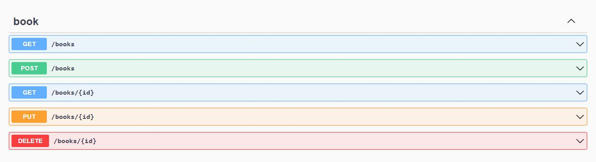

# .Net Book Store API

### `dotnet watch run`

Open [http://localhost:3000](http://localhost:3000) to view it in your browser.

## Project Features

:heavy_check_mark: In this project was created an API  
:heavy_check_mark: You could add book, delete book, update book and you can list book in your book store app.  
:heavy_check_mark: When the book already added, you could not add book, you will receive a warning.  
:heavy_check_mark: If you try the book have deleted the non-existent book, you receive a warning.  

## :fire: Technologies and Libraries

:point_right: .Net  
:point_right: Auto Mapper  
:point_right: Entity Framework  
:point_right: Fluent Validation  

## Screenshot

